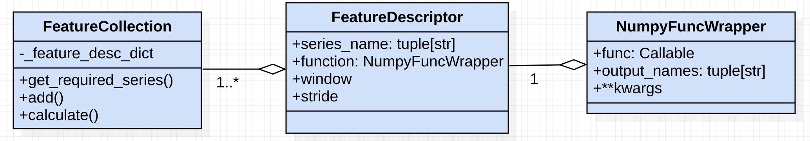

# Feature extraction guide
## Working Example ✅

_tsflex_ is built to be intuitive, so we encourage you to copy-paste this code and toy with some parameters!

```python
import pandas as pd; import scipy.stats as ss; import numpy as np
from tsflex.features import FeatureDescriptor, FeatureCollection, NumpyFuncWrapper
from tsflex.features import MultipleFeatureDescriptors

# 1. Construct the collection in which you add all your features
fc = FeatureCollection(
    feature_descriptors=[
        FeatureDescriptor(
            function=NumpyFuncWrapper(func=ss.skew,output_names="skew"),
            series_name="lux", window="1day", stride="6hours"
        )
    ]
)

# -- 1.1. Add multiple features to your feature collection
fc.add(FeatureDescriptor(np.min, 'lux', '2days', '1day'))
fc.add(MultipleFeatureDescriptors(
    functions=[ 
        np.mean, np.std,
        NumpyFuncWrapper(func=lambda x: np.sum(np.abs(x)), output_names="abssum") 
    ],
    series_names="lux", windows=["1day", "2days", "3hours"],
    strides=["3hours"]
))

# 2. Get your time-indexed data
## TODO -> look into wget time series public
data = pd.Series(data=np.random.random(10_000), 
    index=pd.date_range("2021-07-01", freq="1h", periods=10_000)).rename('lux')
# -- 2.1 drop some data, as we don't make frequency assumptions
data = data.drop(np.random.choice(data.index, 200, replace=False))

# 3. Calculate the feature on some data
fc.calculate(data=data, n_jobs=1, return_df=True)
# which outputs:
```
|      index          |  **lux__skew__w=1D_s=12h**  |   **lux__amin__w=2D_s=1D** |  **lux__...** |
|:-------------------:|:-------------------------------|:------------------------------|:---|
| 2021-07-02 00:00:00 |                     -0.0607221 |                   nan         |   ... |
| 2021-07-02 12:00:00 |                     -0.142407  |                   nan         |  ... |
| 2021-07-03 00:00:00 |                     -0.283447  |                     0.042413  | ... |
| 2021-07-03 12:00:00 |                     -0.353314  |                   nan         | ... |
| 2021-07-04 00:00:00 |                     -0.188953  |                     0.0011865 | ... |
| 2021-07-04 12:00:00 |                      0.259685  |                   nan         | ... |
| 2021-07-05 00:00:00 |                      0.726858  |                     0.0011865 | ... |
| ... |                      ...  |                     ... | ... |


<br>

!!!tip 
    More advanced feature-extraction examples can be found [in these example notebooks]()
    <br>TODO: fix link

<br>

## Getting started 🧐
### Classes & feature-output


As shown above, there are 3 relevant classes for feature-extraction.

1. [FeatureCollection](/tsflex/features/#tsflex.features.FeatureCollection): serves as a registry, withholding the to-be-calculated _features_
2. [FeatureDescriptor](/tsflex/features/#tsflex.features.FeatureDescriptor): an instance of this class describes a _feature_. <br>Features are defined by:
      * `series_name`: the names of the signal(s) which this feature will use. 
      * `function`: the _Callable_ feature-function - e.g. _np.mean_
      * `window`: the _time-based_ window -  e.g. _"1hour"_
      * `stride`: the _time-based_ stride - e.g. _"2days"_
3. [NumpyFuncWrapper](/tsflex/features/#tsflex.features.NumpyFuncWrapper): a wrapper around _Callable_ functions, intended for advanced feature function definitions, such as:
    * features with multiple output columns
    * passing _**kwargs_ to feature functions

The snippet below shows how the `FeatureCollection` & `FeatureDescriptor` class interplay:

```python
import numpy as np; import scipy.stats as ss
from tsflex.features import FeatureDescriptor, FeatureCollection

# The FeatureCollection takes a List[FeatureDescriptors] as input
fc = FeatureCollection(feature_descriptors=[
        # There is no need for NumpyFuncWrapper when using "simple" features
        FeatureDescriptor(np.mean, "series_a", "1hour", "15min"),
        FeatureDescriptor(ss.skew, "series_b", "3hours", "5min")
    ]
)

# We can still add features after instantiating.
fc.add(features=[FeatureDescriptor(np.std, "series_a", "1hour", "15min")])
fc.calculate(...)
```
<br>

### Output format
The last line in this snippet above will calculate the features on the passed data. You can find more information about the data-formats in the section below. However, already want to describe the output of this `calculate` method; which is a `time-indexed pd.DataFrame` with column names<br>

> `<SERIES-NAME>__<FEAT-NAME>__w=<WINDOW>__s=<STRIDE>`.

The column-name for the feature defined on the penultimate line will thus be `series_a__std__w=1h__s=15m`.

<br>

## Limitations 📢

It is important to note that there a still some, albeit logical, **limitations** regarding the supported [data format](/tsflex/#data-formats).<br>
These limitations are:

1. Each `ts` must have a `pd.DatetimeIndex` that **increases monotonically**
      - **Countermeasure**: Apply _[sort_index()](https://pandas.pydata.org/pandas-docs/stable/reference/api/pandas.DataFrame.sort_index.html)_ on your not-monotonically increasing data
2. No duplicate `ts` names are allowed
      - **countermeasure**: rename your `ts`
3. We support various data-types. e.g. (np.float32, string-data, time-based data). However, it is the end-users responsibility to use a function which interplays nicely with the data's format.

<br>

## Advanced usage

### Multivariate-data
There are no assumptions made about the `data` its `time-ranges`.<br>
However, the end-user must take some things in consideration.

### Multiple time series

* function's that work on **multiple time-series**: see the `tsflex.chunking` module for more info.


### Irregularly sampled data

This case may cause that not all windows on which features are calculated have the same amount of samples.<br>
When using multivariate data, with either different sample rates or with an irregular data-rate, you cannot make the assumption that all windows will have the same length. Your feature extraction method will thus 
  * will the s 

<br>

---
